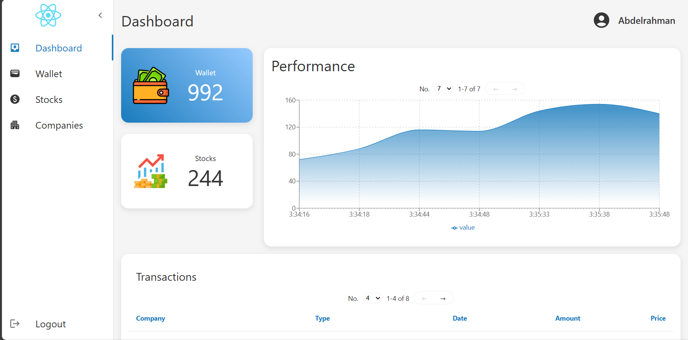

<div align="center">
    <h1 align='center'>⚡️<i>Stock Market Trading</i>⚡️</h1>
    <p>.</p>
</div>

<div align="center">

[](https://github.com/Abd-ELrahmanHamza/Stock-Market-Trading/contributors)
[](https://github.com/Abd-ELrahmanHamza/Stock-Market-Trading/issues)
[](https://github.com/Abd-ELrahmanHamza/Stock-Market-Trading/blob/master/LICENSE)
[](https://github.com/Abd-ELrahmanHamza/Stock-Market-Trading/network)
[](https://github.com/Abd-ELrahmanHamza/Stock-Market-Trading/stargazers)
[](https://img.shields.io/github/languages/count/Abd-ELrahmanHamza/Stock-Market-Trading)

</div>


Discover Stock Market Trading a React.js web app for easy portfolio management and stock trading. Whether you're an admin or an investor, we've got you covered.

## Features

### Investor View

1. **Stock Value Trends**

   - Investors can visualize the value of a stock over time for a specific company. The display can be customized to show trends over a specified window of time.

2. **Wallet Management**

   - Investors can deposit funds into their wallet to facilitate seamless stock trading transactions.

3. **Buy Shares**

   - Purchase a specified number of shares in a chosen company using the funds available in the investor's wallet.

4. **Sell Shares**

   - Sell previously acquired shares and have the equivalent amount transferred back to the investor's wallet.

5. **Transaction Statistics**
   - Investors can review detailed statistics for their previous transactions, including gains, losses, and any other relevant metrics.




### Admin View

1. **Add New Stocks**

   - The admin can seamlessly add new stocks for companies, specifying their initial price per share.

2. **Transaction Log Review**

   - Dive into the transaction logs of a specific investor to gain insights into their trading activities.

3. **Platform Statistics**
   - Access overall statistics for the platform, including the number of registered investors, transaction history, amount of money transferred over time, and other relevant metrics.


## Getting Started

To run the Stock Market Trading Platform locally, follow these steps:

1. Clone the repository:
   ```bash
   git clone https://github.com/Abd-ELrahmanHamza/Stock-Market-Trading.git
   ```
2. Navigate to the server project directory:
   ```bash
   cd server
   ```
3. Install the required dependencies:
   ```bash
    npm install
   ```
4. Run the application:
   ```bash
    npm start
   ```
5. Navigate to the project directory:
   ```bash
   cd client
   ```
6. Install the required dependencies:
   ```bash
   npm install
   ```
7. Run the application:
   ```bash
    npm start
   ```
8. Open [http://localhost:3000](http://localhost:3000) to view it in the browser.

## ✍️ Contributors

<table>
<tr>
<td align="center">
<a href="https://github.com/Abd-ELrahmanHamza" target="_black">
<br /><sub><b>Abdelrahman Hamza</b></sub></a><br />
</td>

</tr>
 </table>

## 🔒 License <a name = "license"></a>

> This software is licensed under MIT License, See [License](https://github.com/Abd-ELrahmanHamza/Stock-Market-Trading/blob/main/LICENSE) .
